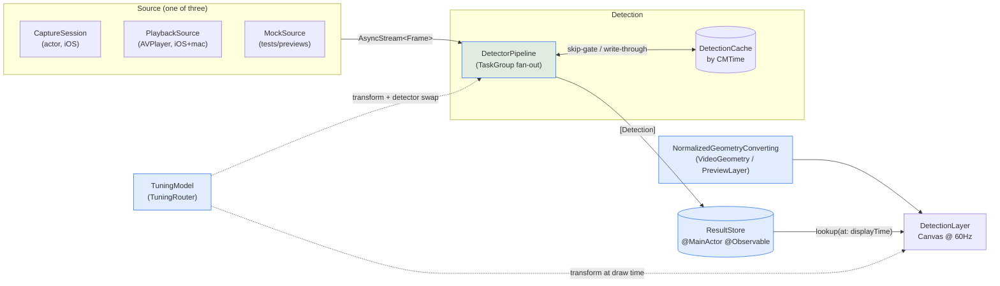
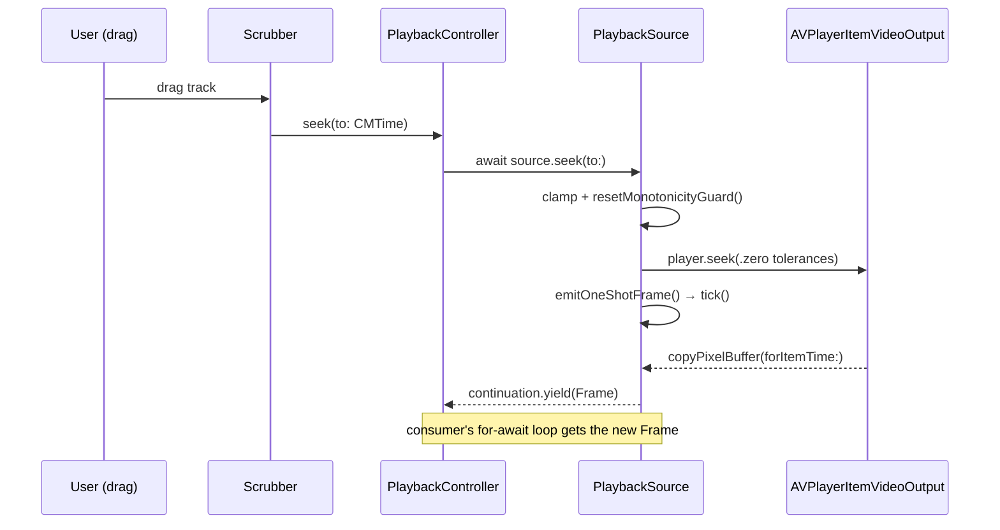

# Iris — Codebase Tour

_A guided walk through the layers, the contracts that hold them together, and
the wiring you should actually look at. Pointers are `path:line` — clickable in
most editors. Snapshot: 2026-05-25 (M1–M5 complete, through M5·P6)._

> This is a **map for reading**, not a spec. For *why* things are the way they
> are, see [`plans/DECISIONS.md`](../plans/DECISIONS.md); for *what's next*, see
> [`plans/STATUS.md`](../plans/STATUS.md).

---

## 0. The one-paragraph mental model

Iris is camera/ML scaffolding shaped around **one data type and three
protocols**. A `Frame` is a source-agnostic pixel buffer + metadata. A `Source`
vends `AsyncStream<Frame>`. A `Detector` turns a `Frame` into `[Detection]`. The
overlay reads those detections back out (keyed by timestamp) and draws them in
view space. Everything else — capture, playback, tuning, caching — is an
implementation of, or an adapter around, those four things. **Capture and
playback are interchangeable** because both are just a `Source`; the detector
and renderer never learn where a frame came from.

```
            ┌──────────── the spine (root of Sources/Iris/) ────────────┐
            │   Frame  ·  Source protocol  ·  Detector protocol          │
            └───────────────────────────────────────────────────────────┘
                 ▲              ▲                  ▲              ▲
        implements│    implements│         consumes│      produces│
            ┌──────┴──┐   ┌──────┴────┐      ┌──────┴────┐   ┌─────┴──────┐
            │ Capture │   │ Playback  │      │ Detection │   │  Overlay   │
            │ (iOS)   │   │ (iOS+mac) │      │           │   │            │
            └─────────┘   └───────────┘      └─────┬─────┘   └─────┬──────┘
                                                   │  reaches into  │
                                                   └──── Tuning ────┘
                                              (TuningRouter cross-cuts both)
```

---

## 1. Package shape & platforms

- [`Package.swift`](../Package.swift) — single library target `Iris`, single test
  target. iOS 26 / macOS 26 floor. **Swift 6 language mode** (`swiftLanguageModes: [.v6]`),
  strict concurrency on. The two `*.html` previews under `Overlay/` are `exclude`d
  from the build (they're visual references, not source).
- One target, **folder-organized** by responsibility. Splitting into separate
  modules later is a non-breaking change (locked in DECISIONS).
- `#if os(iOS)` is used for **whole-subsystem** gating only — the entire
  `Capture/` folder. macOS gets everything except live camera.

**Folder → role:**

| Folder | Platforms | Role |
| --- | --- | --- |
| `Sources/Iris/*.swift` (root) | both | The spine: `Frame`, `Source`, `Detector`-adjacent core types |
| `Capture/` | iOS only | `AVCaptureSession` → `AsyncStream<Frame>` + SwiftUI preview |
| `Playback/` | both | `AVPlayer`/asset → same `AsyncStream<Frame>` + scrubber |
| `Detection/` | both | `Detector` protocol, pipeline, cache, Vision adapter, capabilities |
| `Overlay/` | both | coordinate conversion + SwiftUI drawing of `[Detection]` |
| `Tuning/` | both | capability-derived settings + UI; `TuningRouter` seam |

---

## 2. The spine — read these first

Three contracts. If you understand these, the rest is adapters.

### `Frame` — the source-agnostic unit

[`Sources/Iris/Frame.swift:16`](../Sources/Iris/Frame.swift)

```swift
public struct Frame: @unchecked Sendable {
    public let pixelBuffer: CVPixelBuffer   // IOSurface-backed → zero-copy actor hops
    public let timestamp: CMTime            // source-defined clock (see below)
    public let orientation: CGImagePropertyOrientation
    public let source: SourceKind
    public let format: PixelFormat
    public let dimensions: CGSize
}
```

- `@unchecked Sendable` rests on **immutability**: producers don't mutate after
  wrapping; consumers never mutate.
- **Timestamp is per-source** but coherent end-to-end: capture uses the AVF host
  clock, playback uses asset time. The invariant: a `Frame` and the
  `[Detection]` derived from it carry the *same* clock, so `ResultStore` lookups
  line up (see §6).

### `Source` — the frame-stream contract

[`Sources/Iris/Source.swift:6`](../Sources/Iris/Source.swift)

```swift
public protocol Source: AnyObject, Sendable {
    var frames: AsyncStream<Frame> { get }   // single-consumer, .bufferingNewest(N)
    var state: SourceState { get async }     // errors surface here, not in the stream
    func start() async throws
    func stop() async
    func invalidate() async                  // finishes the stream; don't reuse
}
```

The frame stream is **non-throwing** — session-level failures land in `state`
(an `@Observable` enum), not as a thrown error mid-iteration. Three
implementations: `CaptureSession`, `PlaybackSource`, `MockSource`.

### `Detector` — the pluggability seam

[`Sources/Iris/Detection/Detector.swift:25`](../Sources/Iris/Detection/Detector.swift)

```swift
public protocol Detector: Sendable {
    var availability: DetectorAvailability { get }   // .available / .deviceNotEligible / …
    var modelIdentifier: String { get }
    func prewarm() async
    func detect(in frame: Frame) async throws -> [Detection]
}
```

No isolation declared — stateless detectors are plain `Sendable` structs;
stateful ones wrap an internal actor. **Model swap = replace the instance**,
never mutate one in flight.

### Supporting core types (one-liners)

| Type | What it models | Pointer |
| --- | --- | --- |
| `SourceState` | lifecycle enum: idle/requestingPermission/running/paused/failed/stopped | [`SourceState.swift:5`](../Sources/Iris/SourceState.swift) |
| `SourceKind` | provenance: `.camera(id)` / `.playback(AssetID)` / `.mock(id)` | [`SourceKind.swift:3`](../Sources/Iris/SourceKind.swift) |
| `SourceError` | thrown/surfaced failures (permission, no device, asset load…) | [`SourceError.swift:6`](../Sources/Iris/SourceError.swift) |
| `PixelFormat` | `.yuv420BiPlanarFull` (default, Vision-native) / `.bgra8` | [`PixelFormat.swift:8`](../Sources/Iris/PixelFormat.swift) |
| `MediaType` | `.video` / `.audio` permission tag | [`MediaType.swift:2`](../Sources/Iris/MediaType.swift) |
| `AssetID` | typed wrapper so you can't swap it for a camera ID | [`AssetID.swift:5`](../Sources/Iris/AssetID.swift) |
| `Detection` | the output value (see §5) | [`Detection.swift:21`](../Sources/Iris/Detection/Detection.swift) |

---

## 3. The frame pipeline (the big picture)

This is the data flow every feature plugs into:



The dotted lines from `TuningModel` are the cross-cutting seam — covered in §8.

---

## 4. Capture layer (iOS only)

`Capture/` turns a live camera into the same `AsyncStream<Frame>` everything else
consumes. The whole folder is under `#if os(iOS)`.

**The hot path — camera buffer → `Frame`:**

1. `CaptureSession` is an **actor with a custom serial executor** (the capture
   queue), so AVF delegate callbacks land *already isolated* — no per-frame Task
   spawn, no actor hop.
   - actor decl [`CaptureSession.swift:31`](../Sources/Iris/Capture/CaptureSession.swift), executor [`:37`](../Sources/Iris/Capture/CaptureSession.swift)
   - stream created on init: `AsyncStream.makeStream(... bufferingNewest(1))` [`CaptureSession.swift:68`](../Sources/Iris/Capture/CaptureSession.swift)
   - `startRunning()` / `stopRunning()` [`:115` / `:121`](../Sources/Iris/Capture/CaptureSession.swift), `continuation.finish()` in invalidate [`:133`](../Sources/Iris/Capture/CaptureSession.swift)
2. `SampleBufferRouter` is the `AVCaptureVideoDataOutputSampleBufferDelegate`. Its
   `captureOutput(_:didOutput:from:)` extracts the `CVPixelBuffer`, builds a
   `Frame`, and **yields it**.
   - delegate body [`SampleBufferRouter.swift:37`](../Sources/Iris/Capture/SampleBufferRouter.swift), the `continuation.yield(frame)` [`:74`](../Sources/Iris/Capture/SampleBufferRouter.swift)
   - attached to the session on the actor's queue [`CaptureSession.swift:191`](../Sources/Iris/Capture/CaptureSession.swift)

**The SwiftUI preview** is deliberately kept separate from the frame stream (the
preview layer renders camera pixels directly; it is *not* fed `Frame`s):

- `PreviewSource` / `PreviewTarget` protocols [`PreviewSource.swift:10` / `:25`](../Sources/Iris/Capture/PreviewSource.swift)
- `AVCapturePreviewSource` hands the session to the view on MainActor [`AVCapturePreviewSource.swift:23`](../Sources/Iris/Capture/AVCapturePreviewSource.swift)
- `PreviewView` — a `UIView` whose `layerClass` *is* `AVCaptureVideoPreviewLayer`; owns preview-side rotation [`PreviewView.swift:28`](../Sources/Iris/Capture/PreviewView.swift)
- `CameraPreview` — the `UIViewRepresentable`; `onPreviewLayerReady` hands the layer out so the overlay can build a `PreviewLayerConverter` [`CameraPreview.swift:29`](../Sources/Iris/Capture/CameraPreview.swift)

> **Note the split responsibility:** preview rotation lives on `PreviewView`;
> capture-pixel (horizon-level) rotation lives on `CaptureSession`. They use
> separate `RotationCoordinator`s.

---

## 5. Playback layer (iOS + macOS) — the macOS-primary path

`PlaybackSource` fulfills the same `Source` contract via `AVPlayer` +
`AVPlayerItemVideoOutput`. The interesting parts are **seek** and **what drives
ticks**.

- type decl, `Source` + `@unchecked Sendable` (NSLock-guarded, *not* `@MainActor`,
  to avoid per-frame main hops) [`PlaybackSource.swift:72`](../Sources/Iris/Playback/PlaybackSource.swift)
- stream uses `.bufferingNewest(3)` (vs capture's `1`) to preserve seek-emitted +
  step frames [`PlaybackSource.swift:141`](../Sources/Iris/Playback/PlaybackSource.swift)
- **`tick()`** — the per-frame pull: `copyPixelBuffer(forItemTime:)`, a
  monotonicity guard that drops already-emitted timestamps, then
  `continuation.yield(frame)`. A `.dropped` yield result bumps a cumulative
  drop counter (the honest denominator §6's metrics read) [`PlaybackSource.swift:451`](../Sources/Iris/Playback/PlaybackSource.swift)
- **`seek(to:)`** — frame-accurate (`.zero` tolerances), *does not change state*
  (paused stays paused), resets the monotonicity guard, emits one frame at the new
  position. The paused re-emit reaches the live detect loop — a paused seek both
  re-renders *and* yields a fresh detection (the M5·P5 catch-up guarantee, pinned
  by `PlaybackSourcePausedCatchUpTests`) [`PlaybackSource.swift:320`](../Sources/Iris/Playback/PlaybackSource.swift)

**What drives ticks** — `PlaybackTickDriver` protocol [`PlaybackTickDriver.swift:23`](../Sources/Iris/Playback/PlaybackTickDriver.swift), three implementations:

| Driver | Mechanism | When | Pointer |
| --- | --- | --- | --- |
| `TaskTickDriver` | `Task.sleep` loop ~60Hz | headless / dataset / benchmark | [`:42`](../Sources/Iris/Playback/PlaybackTickDriver.swift) |
| `DisplayLinkTickDriver` | `CADisplayLink` | when a `PlaybackView` is on screen | [`:131`](../Sources/Iris/Playback/PlaybackTickDriver.swift) |
| `ManualTickDriver` | `fire()` per call | tests, deterministic stepping | [`:77`](../Sources/Iris/Playback/PlaybackTickDriver.swift) |

**The UI side:**

- `ScrubberModel` — `@MainActor` protocol (currentTime/duration/state +
  togglePlay/seek/step) that decouples the scrubber from AVF [`ScrubberModel.swift:32`](../Sources/Iris/Playback/ScrubberModel.swift)
- `PlaybackController` — `@MainActor @Observable`, conforms to `ScrubberModel`;
  a **sibling** to `PlaybackSource` (not a replacement) so the source stays off
  the main actor. Periodic time observer + KVO drive the observable state
  [`PlaybackController.swift:41`](../Sources/Iris/Playback/PlaybackController.swift)
- `Scrubber<Model: ScrubberModel>` — generic SwiftUI slider; the track binding
  converts seconds ↔ `CMTime` and calls `model.seek(to:)` [`Scrubber.swift:28`](../Sources/Iris/Playback/Scrubber.swift)
- `PlaybackView` — public entry; `AVPlayerLayer`-backed view (iOS `UIView` /
  macOS `NSView`), installs the `DisplayLinkTickDriver`, hands out the layer via
  `onPlayerLayerReady` [`PlaybackView.swift:50`](../Sources/Iris/Playback/PlaybackView.swift)

**Seek → frame sequence** (the trickiest wiring):



---

## 6. Detection layer

The pluggable inference stage. `DetectorPipeline` is what callers actually use;
individual `Detector`s slot into it.

### `Detection` — the output value

[`Detection.swift:21`](../Sources/Iris/Detection/Detection.swift)

```swift
public struct Detection: Sendable, Hashable {
    public let boundingBox: CGRect   // normalized [0,1], Vision bottom-left origin
    public let label: String
    public let confidence: Float     // [0,1], or 1.0 if the model emits none
    public let keypoints: [Keypoint]? // landmarks / quad corners, same normalized space
    public let mask: Mask?           // segmentation placeholder (payload TBD)
    public let sourceModelID: String
}
```

Coordinates stay **normalized + Vision-native** all the way through. The Y-flip
happens exactly once, in the overlay (§7) — never here.

### `DetectorPipeline` — parallel fan-out + cache + tuning

[`DetectorPipeline.swift:20`](../Sources/Iris/Detection/DetectorPipeline.swift) (itself a `Detector`)

Three `detect(in:)` overloads, increasingly wired:

- plain [`:58`](../Sources/Iris/Detection/DetectorPipeline.swift)
- `+ cache` (playback path) [`:86`](../Sources/Iris/Detection/DetectorPipeline.swift)
- `+ cache + tuning` (the full M4/M5 channel) [`:117`](../Sources/Iris/Detection/DetectorPipeline.swift)

Internals worth seeing:
- `withThrowingTaskGroup` fan-out, **results re-ordered to input order** for
  deterministic output (matters for overlay flicker & sidecar diffs) [`:156`](../Sources/Iris/Detection/DetectorPipeline.swift)
- tuning routing: if `tuning.currentDetector` is set, run *that* instead of the
  array (hot-swap) [`:151`](../Sources/Iris/Detection/DetectorPipeline.swift)
- output transform applied **after** cache hit *or* fresh inference, so filter
  changes show through cached frames [`:145`](../Sources/Iris/Detection/DetectorPipeline.swift)
- write-through caches **unfiltered** output [`:176`](../Sources/Iris/Detection/DetectorPipeline.swift)

### Caching

- `DetectionCache` protocol — declared *in Detection* (so the dependency runs
  Overlay→Detection, not inverted), implemented *in Overlay* by `ResultStore`
  [`DetectionCache.swift:29`](../Sources/Iris/Detection/DetectionCache.swift)
- `TimestampedDetections` — `[Detection]` + the `CMTime` that produced it; empty
  array is meaningful ("ran, found nothing") [`TimestampedDetections.swift:10`](../Sources/Iris/Detection/TimestampedDetections.swift)

### `DetectorCapabilities` — the M5 centerpiece

[`DetectorCapabilities.swift:41`](../Sources/Iris/Detection/DetectorCapabilities.swift) — the *honest declaration* of what a detector actually produces. Four axes:

```swift
public struct DetectorCapabilities: Sendable, Hashable {
    public let geometryKinds: Set<GeometryKind>       // .box .quad .keypoints .mask …  [:86]
    public let confidence: ConfidenceSemantics        // the spine — see below           [:126]
    public let tunableKnobs: SettingSchema            // reuses the settings schema
    public let introspectableFields: [IntrospectableField] // read by overlay + DetectionInspector [:181]
}
```

`ConfidenceSemantics` is the bug-fix at the heart of "honest detectors": it
distinguishes a real probability from Vision's constant `1.0`:
`.probabilistic` / `.perElement` / `.none` / `.derivedScalar(label:)`. This one
type drives both what the overlay draws and what tuning UI appears (§8).

> **Self-describing detections.** As of M5, the inspector (§7) and overlay read
> a detection's own fields — `skeleton`, `keypoints`, `readout` — not the
> producing detector's capabilities. `Detection` now carries a `Skeleton`
> (edge topology) and a `Readout` (the honest label-text the default formatter
> appends, e.g. an aspect ratio or joint count) so the geometry it carries is
> drawable and labelable without back-channeling to the detector. Locked in
> DECISIONS ("Self-describing detections", 2026-05-25).

### `VisionRectanglesDetector` — the worked example (biggest file, ~734 lines)

[`Vision/VisionRectanglesDetector.swift:38`](../Sources/Iris/Detection/Vision/VisionRectanglesDetector.swift) — a stateless `struct` conforming to `TunableDetector`.

- **Vision call site** — native `async` value-type API, no Obj-C bridge:
  `DetectRectanglesRequest().perform(on:orientation:)` [`:221`](../Sources/Iris/Detection/Vision/VisionRectanglesDetector.swift)
- **quad mapping** — Vision's four corners → `Detection.keypoints` in the
  documented order `topLeft, topRight, bottomRight, bottomLeft` (downstream relies
  on this order) [`:235`](../Sources/Iris/Detection/Vision/VisionRectanglesDetector.swift)
- declares `.quad + .box` geometry, `.none` confidence [`:117`](../Sources/Iris/Detection/Vision/VisionRectanglesDetector.swift)
- **M5 quadrature rework** — Vision is queried at a *fixed permissive 45°*
  [`:195`](../Sources/Iris/Detection/Vision/VisionRectanglesDetector.swift); the
  tunable tolerance is a **pure post-hoc Swift filter** computed from corner
  angles, so the knob is symmetric (tighten/loosen both filter-tier, instant).
  Predicate [`:563`](../Sources/Iris/Detection/Vision/VisionRectanglesDetector.swift), angle math via `atan2(|cross|,dot)` [`:723`](../Sources/Iris/Detection/Vision/VisionRectanglesDetector.swift)
- `apply(_:)` (the tier classifier) [`:320`](../Sources/Iris/Detection/Vision/VisionRectanglesDetector.swift), `transform(for:)` (the filter projection, reused on fresh + cached) [`:529`](../Sources/Iris/Detection/Vision/VisionRectanglesDetector.swift)

- `MockDetector` — returns a fixed `[Detection]`; the detection-side twin of
  `MockSource` [`MockDetector.swift:9`](../Sources/Iris/Detection/MockDetector.swift)

### `VisionBodyPoseDetector` — the second concrete detector (the seam paying off)

[`Vision/VisionBodyPoseDetector.swift:39`](../Sources/Iris/Detection/Vision/VisionBodyPoseDetector.swift) — the second `TunableDetector`, added in M5·P3/P4. It exercises the pluggability seam with a non-rectangles model: no new pipeline, no new overlay path, it slots in by conforming.

- declares `.keypoints` geometry + **`.perElement` confidence** — the honest
  signal lives on each joint, not on the detection [`:73`/`:74`](../Sources/Iris/Detection/Vision/VisionBodyPoseDetector.swift)
- `detect(in:)` maps Vision joints → `Detection.keypoints` and stamps the
  canonical `Skeleton.humanBodyPose` topology so the overlay can stroke limbs
  without joint knowledge [`:124`](../Sources/Iris/Detection/Vision/VisionBodyPoseDetector.swift); the topology constant [`:347`](../Sources/Iris/Detection/Vision/VisionBodyPoseDetector.swift)
- **`minimumJointConfidence`** — the body-pose analogue of the quadrature filter:
  a filter-tier per-joint threshold (default 0.3) that drops sub-threshold joints
  and recomputes the envelope/mean/readout from survivors, so the slider retunes
  instantly off cache with no re-inference [`apply(_:):204`](../Sources/Iris/Detection/Vision/VisionBodyPoseDetector.swift)

`Skeleton` (edge topology) [`Skeleton.swift:6`](../Sources/Iris/Detection/Skeleton.swift) and `Readout` (the honest label-text fragment) [`Readout.swift:5`](../Sources/Iris/Detection/Readout.swift) are the two `Detection` fields that make a pose self-describing — see the callout above.

### `DetectionMetrics` — the honest pipeline gauge

[`DetectionMetrics.swift:35`](../Sources/Iris/Detection/DetectionMetrics.swift) — `@MainActor @Observable`. Iris sheds frames under load (best-effort, locked in DECISIONS), which makes strain invisible by construction; this instrument *measures* it without changing pipeline behavior.

- `recordInference(seconds:)` — the single per-frame call site; feeds a rolling
  window for `averageInferenceMillis` + `effectiveDetectionsPerSecond` [`:107`](../Sources/Iris/Detection/DetectionMetrics.swift)
- **honest drop counting** — `setDropped(_:)` mirrors the source's cumulative
  `.dropped`-yield counter rather than guessing; `dropRate` is derived, not
  primary [`:133`/`:81`](../Sources/Iris/Detection/DetectionMetrics.swift)
- `compactSummary` — the one-line HUD pill (`312 done · 0 drop · 28 ms`); raw
  counts lead, the % is demoted [`:164`](../Sources/Iris/Detection/DetectionMetrics.swift)
- `DetectionMetricsView` — the full-pane readout (Frames / Inference / Throughput),
  raw `emitted · processed · dropped` leading, drop-% trailing small [`DetectionMetricsView.swift:19`](../Sources/Iris/Detection/DetectionMetricsView.swift)

---

## 7. Overlay layer — coordinate conversion + drawing

The one invariant this layer owns: **normalized → view-space conversion happens
once, behind a protocol.** No call site does the math itself. As of M5·P6 there
is a single authority for that math — `VideoGeometry` — and the protocol no
longer threads an on-screen video rect through each call.

### The conversion seam

`NormalizedGeometryConverting` [`NormalizedGeometryConverting.swift:35`](../Sources/Iris/Overlay/NormalizedGeometryConverting.swift):

```swift
public protocol NormalizedGeometryConverting: Sendable {
    func viewRect(forNormalized rect: CGRect) -> CGRect
    func viewPoint(forNormalized point: CGPoint) -> CGPoint
}
```

Note the absence of a `videoRect:` parameter — box geometry is resolved
*before* a converter is built (each backend owns its own display box), so
callers never thread an on-screen rect through each conversion call.

**`VideoGeometry` is the single coordinate-mapping authority**
[`VideoGeometry.swift:44`](../Sources/Iris/Overlay/VideoGeometry.swift) — a pure
`Sendable` value type: `contentSize` + `containerSize` + `contentMode` →
`displayRect` + Y-flip. It is the one place upright-normalized detection
coordinates ("truth") are placed into the on-screen video box (aspect-fit
letterbox/pillarbox or aspect-fill crop, centered) with the Y-flip applied.

- `displayRect` — the aspect-fit/-fill placement math; the centered box the
  content occupies [`:81`](../Sources/Iris/Overlay/VideoGeometry.swift)
- `transform` — the single "place + Y-flip" affine matrix (`y = minY + (1 - u.y)·h`);
  `viewRect`/`viewPoint` both go through it [`:115`](../Sources/Iris/Overlay/VideoGeometry.swift)

**There is deliberately no rotation or mirroring here.** By the time anything
reaches the overlay, frames and detections are already **upright** — capture
rotates the buffer on the `AVCaptureConnection` and stamps `.up`, Vision is
handed `frame.orientation`, the player displays upright. Orientation/mirroring
are *source* concerns; re-applying them in the overlay would double-apply work
done upstream. Locked in DECISIONS ("VideoGeometry = single coordinate-mapping
authority; orientation/mirroring upstream", 2026-05-25). The earlier
two-converter story — `PlayerLayerConverter` doing aspect-fit math independently,
with the Y-flip living in its static helper — is **gone**: that type was retired
and its math folded into `VideoGeometry`.

Two backends, picked by source:

| Converter | Used for | How | Pointer |
| --- | --- | --- | --- |
| `VideoGeometry` | playback (iOS + macOS) | the authority above: derives its own `displayRect` from `containerSize` + `contentSize`, applies the Y-flip — no AVF layer needed | [`VideoGeometry.swift:44`](../Sources/Iris/Overlay/VideoGeometry.swift) |
| `PreviewLayerConverter` | live capture (iOS) | delegates to AVF `layerRectConverted(fromMetadataOutputRect:)` — AVF owns the live layer's `videoGravity` letterbox math + front-cam mirroring; ignores any externally-supplied size | [`PreviewLayerConverter.swift:33`](../Sources/Iris/Overlay/PreviewLayerConverter.swift) |

### The drawing view

`DetectionLayer` [`DetectionLayer.swift:41`](../Sources/Iris/Overlay/DetectionLayer.swift) — a `Canvas` inside a 60Hz `TimelineView(.animation)`, decoupled from detector cadence. It is **no longer generic over a converter type**: it takes a size-keyed `makeConverter: (CGSize) -> any NormalizedGeometryConverting` and wraps its body in a `GeometryReader` — the ONE place the SwiftUI container size is measured. Playback callers return a `VideoGeometry` built against `proxy.size`; capture callers ignore the size and return a `PreviewLayerConverter`.

- body: `GeometryReader` → `makeConverter(proxy.size)` → `displayTimeSource()` →
  `store.lookup(at:)` → optional tuning transform → draw each [`:110`](../Sources/Iris/Overlay/DetectionLayer.swift)
- `draw(_:)` geometry dispatch — **skeleton → quad → box**: a detection carrying
  a `skeleton` strokes connected joints; one carrying the four named corners
  strokes the **real quad**; everything else is the axis-aligned bbox [`:214`](../Sources/Iris/Overlay/DetectionLayer.swift). Corner extraction [`quadCorners:161`](../Sources/Iris/Overlay/DetectionLayer.swift), skeleton edges [`skeletonSegments:186`](../Sources/Iris/Overlay/DetectionLayer.swift) — every point routed through the converter, never a re-derived Y-flip
- `.drawingGroup()` (Metal) + `.allowsHitTesting(false)` (gestures pass through)

`OverlayStyle` — per-label color, stroke width, label formatter (closures, all
`@Sendable`) [`OverlayStyle.swift:26`](../Sources/Iris/Overlay/OverlayStyle.swift).

### `ResultStore` — the cache the overlay reads

[`ResultStore.swift:32`](../Sources/Iris/Overlay/ResultStore.swift) — `@MainActor @Observable`, conforms to `DetectionCache`. Timestamps are quantized into buckets (default one 30fps frame).

- **`lookup(at:stale:)`** — best-effort **nearest-neighbor** within a window of
  `min(2×quantization, staleness)`; returns `[]` if the detector has stalled.
  *No latency compensation* — overlays trail the subject by detection latency (a
  locked decision) [`:89`](../Sources/Iris/Overlay/ResultStore.swift)
- live vs playback staleness thresholds (500ms vs 2s) are fields [`:44`/`:50`](../Sources/Iris/Overlay/ResultStore.swift)

### `DetectionInspector` — the render/cache bisector

[`DetectionInspector.swift:32`](../Sources/Iris/Overlay/DetectionInspector.swift) — `@MainActor`, the data-truth complement to the spatial overlay (M5·P5). It reads the **same** `ResultStore.lookup(at:stale:)` the overlay reads, with an identical call shape (same `displayTimeSource()` + `stalenessThreshold`), so the two always see the same input — which makes it a bisector: inspector lists but canvas is blank → render bug; both empty → detector/cache bug.

- **self-describing** — every line is derived from the `Detection`'s own fields
  (`skeleton`/`keypoints`/`readout`/`boundingBox`/`confidence`), never the
  producing detector's capabilities. The `introspectableFields` schema (§6) is
  the structured source of truth this view renders against.
- honest confidence — with keypoints it shows the per-joint min/mean/max spread
  and labels the flat `detection.confidence` as a *mean*, not a probability
  [`confidenceDetail:182`](../Sources/Iris/Overlay/DetectionInspector.swift)
- a **Raw** toggle dumps every field literally; 30Hz `TimelineView` (half the
  overlay's 60Hz — it's a text panel) [`:64`](../Sources/Iris/Overlay/DetectionInspector.swift)

### Visual previews (the "favorite pattern")

- [`Overlay/box-rendering.html`](../Sources/Iris/Overlay/box-rendering.html) — bbox rendering across letterbox/pillarbox scenes; demonstrates the Y-flip.
- [`Overlay/quad-rendering.html`](../Sources/Iris/Overlay/quad-rendering.html) — old bbox vs new corner-quad rendering on a tilted rectangle.
- [`Overlay/skeleton-rendering.html`](../Sources/Iris/Overlay/skeleton-rendering.html) — body-pose skeleton rendering (joints + edges) across scenes.

For the `VideoGeometry` math specifically, the SwiftUI `#Preview` gallery in
[`VideoGeometryPreviews.swift`](../Sources/Iris/Overlay/VideoGeometryPreviews.swift)
is the live oracle: it draws a ground-truth source card with SwiftUI's own
layout, then overlays probes routed *through* `VideoGeometry` — misalignment is
glaring if the placement/Y-flip math is wrong. (This gallery is what surfaced
the earlier rotation-in-geometry mistake as the wrong layer — an architecture
catch caught at the artifact level.)

Open the HTML with `open Sources/Iris/Overlay/skeleton-rendering.html` — no build, no app.

---

## 8. The cross-cutting seam: Tuning

The clever bit. Tuning needs to reach into both the **detection pipeline**
(swap/rebuild the detector, install a filter) and the **overlay** (apply that
filter at draw time even when paused) — *without* Detection or Overlay depending
on the Tuning folder. That's what `TuningRouter` is for.

`TuningRouter` — the minimal `Sendable` protocol both layers accept as
`any TuningRouter` [`TuningModel.swift:30`](../Sources/Iris/Tuning/TuningModel.swift). Referenced from
`DetectorPipeline.swift:130` (reads `currentDetector` + `transform`) and
`DetectionLayer.swift:115` (reads `transform` at draw time); `TuningModel`
conforms.

### Settings model (generic, schema-driven)

> ⚠️ Path note: `DetectorSettings.swift` lives in **`Tuning/`**, not `Detection/`.

- `DetectorSettings` protocol — string-keyed read/write + a static `schema`
  [`Tuning/DetectorSettings.swift:23`](../Sources/Iris/Tuning/DetectorSettings.swift)
- `SettingKind` — `.float/.int/.toggle/.multiSelect/.string/.enum` (the `.string`
  + `.enum` cases are recent) [`Tuning/DetectorSettings.swift:161`](../Sources/Iris/Tuning/DetectorSettings.swift)
- `SettingChange` [`:222`](../Sources/Iris/Tuning/DetectorSettings.swift), `ChangeTier` [`:198`](../Sources/Iris/Tuning/DetectorSettings.swift), `ApplyResult` [`:294`](../Sources/Iris/Tuning/DetectorSettings.swift)
- `TunableDetector` — marries a `Detector` to its `Settings` + `capabilities`,
  and classifies each change via `apply(_:) -> ApplyResult` [`TunableDetector.swift:29`](../Sources/Iris/Tuning/TunableDetector.swift)
- `VisionRectanglesSettings` — concrete knobs; **M5 dropped `minimumConfidence`**
  (Vision rectangles have no real confidence) and made quadrature a filter [`VisionRectanglesSettings.swift:14`](../Sources/Iris/Tuning/VisionRectanglesSettings.swift)

### The three-tier change model

Every knob change is classified into one of three tiers — this is what makes
tuning feel instant where it can be:

| Tier | Meaning | Cost |
| --- | --- | --- |
| `.view` | re-render only | free |
| `.filter(transform:)` | install an output-stage `[Detection]→[Detection]` closure | instant, runs on cached frames too |
| `.detector(rebuilt:)` | new detector instance + cache invalidation | re-inference required |

`TuningModel<Detector>` — `@MainActor @Observable`, conforms to `TuningRouter`
[`TuningModel.swift:120`](../Sources/Iris/Tuning/TuningModel.swift). The dispatch that routes a change to a tier (and invalidates
cache / wakes paused playback on the `.detector` tier) [`:282`](../Sources/Iris/Tuning/TuningModel.swift); typed write
surface [`:242`](../Sources/Iris/Tuning/TuningModel.swift); string-keyed write surface for the derived UI [`:402`](../Sources/Iris/Tuning/TuningModel.swift).

### Capability-derived UI (the M5·P2 payoff)

`CapabilityTuningView<Detector>` renders controls **derived from the detector's
declared capabilities**, not hand-authored per detector. The pure derivation
function is testable on its own:

`CapabilityTuningProjection.controls(for:)` [`CapabilityTuningView.swift:366`](../Sources/Iris/Tuning/UI/CapabilityTuningView.swift) maps:
- `ConfidenceSemantics` → confidence affordance (slider / info / read-only quality / *nothing* for `.none`)
- each `SettingKind` → a control: `.float`→slider, `.int`→stepper, `.toggle`→toggle, `.multiSelect`→chips, `.string`→textfield, `.enum`→picker

Control primitives: `TuningSlider` [`:30`](../Sources/Iris/Tuning/UI/TuningSlider.swift), `TuningToggle` [`:23`](../Sources/Iris/Tuning/UI/TuningToggle.swift), `ClassFilterChips` [`:28`](../Sources/Iris/Tuning/UI/ClassFilterChips.swift). `VisionRectanglesTuningView` is now just a thin wrapper over `CapabilityTuningView` [`VisionRectanglesTuningView.swift:20`](../Sources/Iris/Tuning/UI/VisionRectanglesTuningView.swift).

### End-to-end tuning flow

```mermaid
sequenceDiagram
    participant UI as TuningSlider
    participant M as TuningModel
    participant D as TunableDetector.apply()
    participant P as DetectorPipeline
    participant O as DetectionLayer
    UI->>M: update(key:"quadratureTolerance", to:.float(28.5))
    M->>M: settings.setValue(...) ; build SettingChange
    M->>D: detector.apply(change)
    D-->>M: .filter(transform:)  (quadrature is post-hoc → filter-tier)
    M->>M: self.transform = transform
    Note over P,O: next frame
    P->>P: cache hit OR fresh infer → apply transform
    O->>M: read transform at draw time (works even if paused)
    O->>O: re-stroke quads with new tolerance
```

A `.detector`-tier knob (e.g. raising `minimumAspectRatio`) instead swaps
`self.detector`, clears the transform, invalidates the cache, and fires
`onDetectorTierChange?()` to re-emit a frame for paused playback.

---

## 9. Tests — where to look for executable specs

Tests mirror `Sources/` and use **real fixtures** (sample clips, in
`Tests/IrisTests/Fixtures/`) over mocks where tractable. The most instructive:

| Want to understand… | Read |
| --- | --- |
| capability → control derivation | `Tests/IrisTests/Tuning/CapabilityTuningDerivationTests.swift` |
| tuning tier routing end-to-end | `Tests/IrisTests/Tuning/TuningPipelineRoutingTests.swift` |
| the quadrature filter math | `Tests/IrisTests/Detection/VisionRectanglesQuadratureFilterTests.swift` |
| detector rebuild on `.detector` tier | `Tests/IrisTests/Tuning/VisionRectanglesRebuildTests.swift` |
| seek → frame delivery | `Tests/IrisTests/Playback/PlaybackSourceSeekDeliveryTests.swift` |
| paused seek re-emits a fresh detection | `Tests/IrisTests/Playback/PlaybackSourcePausedCatchUpTests.swift` |
| nearest-neighbor lookup | `Tests/IrisTests/Overlay/ResultStoreTests.swift` |
| coordinate-mapping math (aspect-fit/-fill + Y-flip) | `Tests/IrisTests/Overlay/VideoGeometryTests.swift` |
| Vision against a real clip | `Tests/IrisTests/Detection/VisionRectanglesDetectorFixtureTests.swift` |

Run: `swift test` (note: macOS gets everything except the iOS-only `Capture/`
smoke tests, which are platform-gated).

---

## 10. Suggested reading order

1. **The spine** — `Frame.swift`, `Source.swift`, `Detector.swift`, `Detection.swift`. ~120 lines total; everything else assumes them.
2. **One Source** — skim `PlaybackSource.swift` (`tick()` + `seek()`). It's the macOS path and the most self-contained.
3. **The pipeline** — `DetectorPipeline.swift`. See the three `detect` overloads + the TaskGroup.
4. **The overlay invariant** — `NormalizedGeometryConverting.swift`, then `VideoGeometry.swift` (the single coordinate-mapping authority), then `DetectionLayer.draw()`.
5. **The M5 idea** — `DetectorCapabilities.swift`, then `CapabilityTuningProjection.controls(for:)`, then `VisionRectanglesDetector.apply()`. This is the current frontier and the most interesting design.

---

## 11. Snapshot caveat

This tour covers the tree at **2026-05-25**, `main @ 433f4bf` — **M1–M5
complete, through M5·P6**. The second detector, skeleton overlay, honest
readouts, detection inspector, and runtime metrics are all *present* and are
described in the body (§6/§7), not deferred here. The headline since the
original 2026-05-24 draft:

- **M5·P3/P4** — `VisionBodyPoseDetector` (the second concrete detector, §6), a
  capability-honest skeleton overlay (§7), and honest readouts replacing fake
  confidence percentages; the detector picker moved into the tuning pane.
- **M5·P5** — the `DetectionInspector` render/cache bisector (§7) and richer
  `DetectionMetrics` with honest drop counting (§6).
- **M5·P6** — `VideoGeometry` consolidated coordinate mapping into a **single
  authority** (§7); `PlayerLayerConverter` was retired and `DetectionLayer` is
  no longer generic over a converter. This is the section most rewritten from
  the original draft.

What sits just past this snapshot (see [`plans/STATUS.md`](../plans/STATUS.md)):
**source-orientation correctness** — `PlaybackSource` honoring `preferredTransform`
for portrait clips, and capture front-camera mirroring — both pencilled in, not
yet built. Line numbers drift as code changes; the symbol name in each pointer
will still find the target if a number is off by a few.
