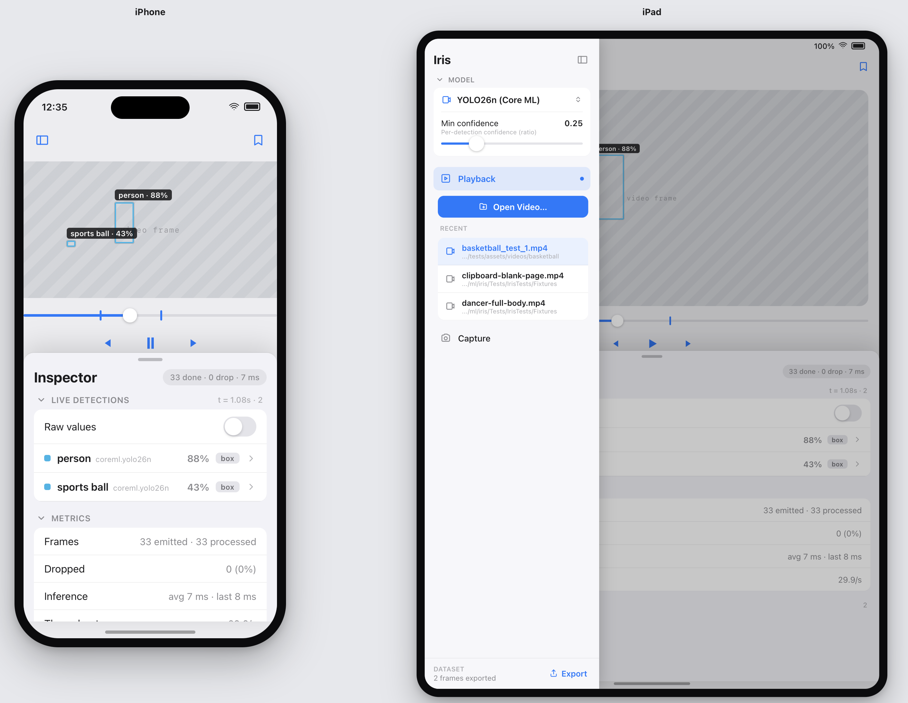

# M9 — Unified shell: one shared model + a left pane that drives the modes

<!-- Working plan. Lifetime ~ this milestone; LOG.md keeps the trail. Status vocab per WORKFLOW.md §"Status trees". -->
_Active milestone (M9) · 2026-05-30 · pulled forward; M8·P5/P6 shelved. **P1–P5 shipped** (✅ on `m9-unified-shell`); **P6 design pass** penciled — designs pending from the user, folds in before the `main` merge._

## Intent

Two changes are the heart of this milestone:

1. **One shared model + min-confidence across all three modes.** Today each page
   carries its **own** `selectedDetectorID` + confidence — **four** independent
   per-page selections that silently drift (the Image picker even flips on
   re-appear). M9 lifts a **single** app-level model selection + one confidence
   knob to the app root, so Playback, Image, and Capture all run the *same* model.
2. **The left pane becomes the driver.** A single cross-platform sidebar owns
   model selection, mode navigation, and each page's `Open…` / `RECENT` — collapsing
   today's divergent shells (iOS `TabView` + macOS `Videos | Images` segmented
   picker) into one. Both of those were stood up in M8·P4 as **interim nav seeds**,
   known-temporary; this pass subsumes them rather than papering over them.

The **sidebar mock below is the visual target.** One shell, built once, shared
across iOS, iPadOS, and macOS, with the divergence collapsed rather than gated.

## Reference mockups

The user provided iPhone + iPad reference mockups on 2026-05-29:



On **iPad / macOS**, the layout is a persistent split: a fixed sidebar on the left
(Iris title, a `MODEL` section pinned to the top, page-rows in the middle, a
`DATASET` strip pinned to the bottom) and the detail on the right (the video/image
frame with overlay boxes, transport controls, and a docked inspector). On **iPhone**,
the same content reflows for a compact width: the sidebar collapses behind a
top-left toggle (a drawer), and the inspector — `LIVE DETECTIONS` + `METRICS` —
becomes a bottom sheet with a drag handle. The bookmark affordance sits top-right of
the detail on every size class.

```
iPad / macOS (persistent split sidebar)        iPhone (sidebar → drawer, inspector → bottom sheet)
┌─ Iris ──────────────[⊟]┐ ┌─────[🔖]┐         ┌[⊟]──────────────────[🔖]┐
│ ⌄ MODEL                 │ │         │         │   ┌──────────────────┐   │
│ ┌─────────────────────┐ │ │  video  │         │   │  video frame +   │   │
│ │ 🎥 YOLO26n (Core ML)⇅│ │ │  frame  │         │   │  overlay boxes   │   │
│ │ Min confidence  0.25 │ │ │ +boxes  │         │   └──────────────────┘   │
│ │ ───●──────────────── │ │ │         │         │   ◀  ❙❙  ▶  (transport)  │
│ └─────────────────────┘ │ │         │         ├───────── drag ───────────┤
│ ▶ Playback           •  │ │ scrubber│         │ Inspector   33·0drop·7ms  │
│ ┌─────────────────────┐ │ │ ◀ ▶ ▶│ │         │ LIVE DETECTIONS  t=1.08·2 │
│ │ ⊞ Open Video…       │ │ │         │         │   Raw values        ( ○) │
│ └─────────────────────┘ │ │         │         │   ● person  …yolo26n 88% ›│
│ RECENT                  │ │inspector│         │   ● sports ball     43% ›│
│   🎥 basketball_test_1  │ │ (docked,│         │ METRICS                   │
│   🎥 clipboard-blank    │ │  faded) │         │   Frames  33 emit·33 proc │
│   🎥 dancer-full-body   │ │         │         │   Dropped         0 (0%)  │
│ 📷 Capture              │ │         │         │   Inference avg7ms·last8ms│
│ ─────────────────────── │ │         │         └───────────────────────────┘
│ DATASET  2 exported [⬆ Export]                
└─────────────────────────┘ └─────────┘         
```

## Structure

- **Global MODEL section, pinned top.** Detector picker + a Min-confidence slider.
  This is **app-level shared state** — one active model + one confidence knob for the
  whole app, not per-page.
- **Page-rows: Playback / Image / Capture.** The *active* page expands inline to
  reveal its **Open …** primary button + its **RECENT** list; inactive pages collapse
  to bare rows. Selecting a row navigates and expands it.
- **DATASET, pinned bottom — reserved-but-deferred.** The mock's bottom `DATASET` /
  `Export` strip belongs to the shelved dataset work (M8·P6, → BOARD §Backlog). The
  shell **leaves the slot** for it rather than wiring export now.
- **Toolbar bookmark, top-right of the detail.** The M7 flag affordance, promoted to
  the toolbar.
- **iPad / macOS.** A persistent `NavigationSplitView` sidebar; the inspector docks
  inside the detail.
- **iPhone.** The sidebar collapses to a drawer (top-left toggle); the inspector
  becomes a bottom sheet (`.presentationDetents` + a drag handle) carrying
  `LIVE DETECTIONS` + `METRICS`.

## Phases

### P1 — Reliability quick wins  ✅ shipped (`m9-unified-shell`)
Independent of the rework — **mergeable on its own**. Three fixes that clear standing
debt before the shell rewrite. All three landed as separate commits; both demo schemes
build green; the `Iris` library is untouched.
- **A1 — macOS movie + model `.fileImporter` collision.** ✅ `ee6fd0f` — Both importers
  were stacked on the root view; SwiftUI honors only **one** `isPresented` importer per
  view, so the model picker silently never presented. Fixed with an `ActiveImporter`
  enum + **one routed `.fileImporter`** (the pattern iOS `ImageContentView` uses); all
  five trigger sites rewired.
- **A6 — gate the Image-mode detector picker + Tune** until a frame is actually
  loaded. ✅ `66e2b0d` — `.disabled(coordinator.frame == nil)` on the picker + Tune in
  shared `ImageDetailView` (covers both iOS Image tab + macOS Images mode).
- **A5 — bookmark-resolve logging.** ✅ `7639638` — `Recent{Images,Videos}.resolve()`
  now logs `isStale` (`.notice`/`.warning`) and elevates missing-file / unresolvable
  cases `.debug`→`.warning` via the existing `os.Logger`.

### P2 — Shared model store (foundation)  ✅ shipped (`m9-unified-shell` · `3af1ed8`)
`Apps/Shared/ModelSelection.swift` — an app-level `@MainActor @Observable` (UserDefaults-backed,
like `RecentDetectors`) holding `detectorID` + `minConfidence`, **persisted**, lifted to each app
root via `.environment`. It **replaced the FOUR independent per-page selections** (iOS Playback +
Image, macOS Videos + Images) with one global model selection. `modelStore` + `RecentDetectors`
were left as-is (already shared via UserDefaults) — only the *selection* lifted.

**Two findings settled during the build:**
- **No per-page min-confidence existed to lift.** Since M5, confidence is *detector-intrinsic*
  (Vision rectangles has none; YOLO26n's lives in its decoder `Settings`/`TuningModel`). So the
  mock's global "Min confidence" slider is *introduced*, not lifted. Decision: `ModelSelection`
  **holds + persists** `minConfidence` (default 0.25) now, but it is **not consumed anywhere yet**
  — its behavior wiring is P3's job (the sidebar MODEL slider).
- **One global model** (user call): the deliberate macOS playback≠image split was **collapsed**
  into the single shared selection — switching the model in any mode switches it everywhere, per
  M9 intent #1.

Fixes **A2** (Image detector silently flipping on re-appear): coordinators don't expose their
installed detector id, so a demo-side `syncedDetectorID` re-installs on `.onAppear` only when the
shared id has drifted (and a source/frame is loaded) — no per-appear flicker. **Build-green;
hands-on smoke of the cross-mode adoption is owed.**

### P3 — Left-pane-driven shell (the heart)
One cross-platform sidebar replacing the iOS `TabView` + the macOS `Videos | Images`
segmented picker. Structure per the mock — `MODEL` section on top (the P2 store +
the min-confidence slider), page-rows (Playback / Image / Capture) with the active
page's `Open…` / `RECENT` inline, a reserved-but-deferred bottom `DATASET` slot
(belongs to shelved M8·P6 — leave room, wire nothing). iPad / macOS = persistent
split + docked inspector; iPhone = sidebar → drawer + inspector → bottom sheet.
Fixes **A4** (tab-switch reload) + **A7** (scroll reset). **Absorbs the M8·P5
`InspectorHandoff` conduit** — one shell holding all coordinators hands frames
directly, with no environment hop.

**Design pass done (2026-05-30; architect).** Resolved forks:
- **Min-confidence = a render-time overlay filter, NOT a detector setting** → small
  **`Iris` library** addition (a confidence floor the overlay applies on draw; raw
  inspector stays unfiltered). Universal across detectors, honest for non-probabilistic
  ones. **For now: a simple GLOBAL floor only.** This **relaxes "demo-wiring only"** for
  this seam — see [DECISIONS.md](../../DECISIONS.md) (2026-05-30) for the two-role model
  + the north-star unified per-detector settings bundle.
- **Shell** = `NavigationSplitView` (free persistent-split↔drawer via `columnVisibility`)
  + custom `VStack` sidebar content + size-class-routed inspector (`.inspector` regular /
  `.sheet`+`.presentationDetents` compact).
- **Detail content survives intact** (`ImageDetailView`, `playbackArea`, capture preview);
  only picker / `Open…` / `RECENT` chrome moves to the sidebar. Extract a shared
  `PlaybackDetailView`. macOS is already ~90% this shell; iOS is the real migration.
- **All coordinators persist for the shell's lifetime** (adopt the macOS model — that's
  what removes A4/A7); **Capture's camera start/teardown keys off active-page selection**
  (not view-disappear) to preserve the documented AVFoundation safety.

**Phasing** (mergeable sub-steps on `m9-unified-shell`) — **all 6 shipped, both schemes build green
(build-only; hands-on smoke owed):** **(1)** ✅ render-time confidence filter (`4c970b7`) → **(2)** ✅
shared shell scaffold on macOS (`cf22a0b`) → **(3)** ✅ extract `PlaybackDetailView`/`CaptureDetailView`
(`05ffad4`) → **(4)** ✅ iOS onto the shell, retire `TabView` (`a8c1730`) → **(5)** ✅ retire
`InspectorHandoff`, direct freeze-from-live (`3392e4a`) → **(6)** ✅ iPhone drawer + bottom-sheet
inspector (`9b56245`).

**🚩 Regression to settle:** step 2 turned the working macOS dataset footer (`Export now`/`Reveal in
Finder`) into a disabled stub — over-read the "reserved-but-deferred DATASET slot" (that was about not
*adding* sidebar export, not removing the macOS export that worked). Recommend restoring. **P4 seam:**
Capture detector still hardcoded to Vision rectangles; `CaptureModel.updateDetector(for:)` is a no-op
hook left for P4.

### P4 — Capture joins the shared model  ✅ shipped (`m9-unified-shell` · `b2201e0`)
Capture was hardcoded to Vision rectangles with no picker. Now it runs the shared
`ModelSelection`: `CaptureModel.detector` is a `var` the detect loop reads **fresh each
frame**, so `updateDetector(for:)` (the P3 hook) swaps the detector **in-loop, no session
restart**; `start(initialEntry:)` resolves the shared `detectorID` on camera start. All
`@MainActor` → race-free. Min-confidence already applied via the overlay (P3 step 1).
Fixes **A3**. Build-only — on-device camera smoke owed.

### P5 — Simplify  ✅ shipped (`m9-unified-shell` · `601c70b`)
One `enum ImportTarget { video, image, model }` + a single `.fileImporting` modifier
replaced two parallel importer modifiers over five `@State` flags (~−67 lines). The iOS
`DocumentPicker` vs macOS `.fileImporter` seam is kept on purpose (DocumentPicker
preserves the security-scoped URL so MRU bookmarks survive relaunch); only the dispatch
unified. **Deferred to backlog** (untouched, as planned): a generic `RecentImages` /
`RecentVideos` base, and any playback / image coordinator merge.

### P6 — Design pass  ✏️ penciled (designs pending from the user)
A round of UI/design changes the user is folding into the unified shell **before** the
milestone merges to `main`. Designs are not yet in hand — this phase is **penciled**
(undefined: no brief, scope TBD) until they arrive, at which point it gets scoped here
(the define-gate) and built. Reopens M9 to 🌱 in-progress: the `main` merge waits on P6.
*(Fill this section in when the designs land — what's changing, which files, the forks.)*

---

**M9 status: 🌱 in-progress — P1–P5 built & green on `m9-unified-shell`; P6 (design pass)
penciled, designs pending.** P6 folds in before the merge, so M9 is no longer
merge-ready. Also owed before `main`: an on-device/hands-on smoke — the P3 shell + the
iPhone compact-split nav fix + P4 live Capture are **build-verified only** (headless; the
iOS sim has no camera). `main` is the deliberate gate. Restored macOS dataset Export/Reveal
(`871648f`), sidebar visual polish (`56039f8`), and the iPhone compact-nav fix (`22ac8c9`)
landed on the branch.

## Leave alone

Out of scope — working and clean, don't touch:
- **`ImageDetailView`** (shared, clean).
- The **coordinator internals**.
- The **`Iris` library package** — **mostly demo-wiring**, with **one sanctioned exception**:
  the P3 render-time confidence-filter seam (the overlay floor) is a small, deliberate
  library addition (see the P3 design note). Everything else in `Sources/Iris/` stays put.
- The **playback detail / overlay / scrubber**.

## Sequencing note

**Pulled forward** (2026-05-29) to be the **active milestone (M9)**, ahead of where it
was originally penciled (after M8·P5/P6). **M8 is closed at its core** — its goal
shipped in P1–P4. **M8·P5** (freeze-from-live) is **built but shelved** (parked on
branch `m8-image`, not merged — a thin convenience); **M8·P6** (dataset tie-in) is
**shelved to backlog** (genuinely future — not training yet). Both moved to
[BOARD §Backlog](../../BOARD.md). The shared-model + left-pane-driven shell supersedes
them as what's next.
